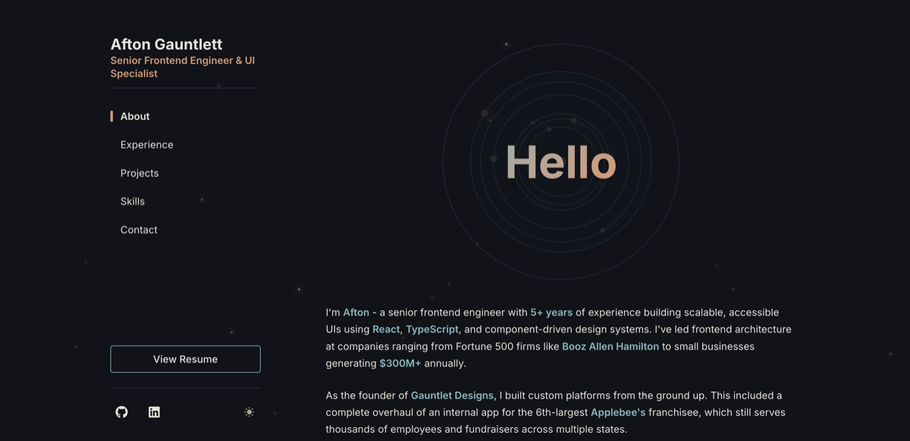

# React Portfolio

[](https://github.com/aftongauntlett/react-portfolio/commits)
[](https://github.com/aftongauntlett/react-portfolio/commits)
[](https://github.com/aftongauntlett/react-portfolio)
[](https://github.com/aftongauntlett/react-portfolio/actions/workflows/ci.yml)


## About

A modern, high-performance portfolio showcasing frontend engineering expertise with integrated game development showcase featuring detailed post-mortems. Built with React 19, TypeScript, and routing for multi-page experiences while maintaining exceptional performance standards.

### **[View Live Portfolio →](https://aftongauntlett.com)**



_Featuring responsive design, smooth animations, and seamless theme switching_

## Tech Stack


**Frontend:** React 19, TypeScript, Tailwind CSS, Framer Motion  
**Routing:** React Router 7 with client-side navigation and SEO-friendly URLs  
**Build:** Vite 7 with esbuild minification and optimized code splitting  
**Testing:** Vitest, React Testing Library, TypeScript strict mode  
**Quality:** ESLint, Prettier, comprehensive accessibility standards (WCAG AA)  
**Performance:** Google Fonts optimization, strategic resource hints, dynamic imports

## Architecture

**Component-driven design** with TypeScript interfaces, custom hooks for state management, and CSS custom properties for theming. Follows modern React patterns with error boundaries and accessibility-first development.

## Project Structure

```
src/
├── assets/                  # Static assets (images, etc.)
├── components/
│   ├── Background.tsx       # Animated starry background component
│   ├── blog/                # Post-mortem content and game showcase components
│   ├── layout/              # Layout components (Layout, SideNav, ExternalPageLayout)
│   ├── sections/            # Portfolio sections (About, Experience, Projects, Skills)
│   ├── shared/              # Reusable components (Button, Card, TruncatedText, etc.)
│   └── Timeline/            # Timeline-specific components
├── constants/               # App constants (navigation, styles, typography)
├── context/                 # React context providers (theme, job contact, detail view)
├── data/                    # Static data (jobs, projects, skills, post-mortems, games)
├── hooks/                   # Custom React hooks (useActiveSection, useSimpleBlogFilter)
├── pages/                   # Page components (Home, BlogPost)
├── utils/                   # Utility functions (dateFormatter, blogHelpers, navigation)
└── test/                    # Test configuration and setup
```

## Features

### **Portfolio**

- **Dark/Light Mode**: System preference detection with manual toggle and animated theme switching
- **Responsive Design**: Mobile-first with fluid typography and optimized layouts
- **Smooth Animations**: Framer Motion with reduced-motion support and performance optimization
- **Interactive Effects**: Custom paint splash hover states and starry night background
- **Working Contact Form**: Formspree integration with form validation

### **Game Development Showcase**

- **Playable Games**: Hosted JS13k competition entries with live demos
- **Technical Post-Mortems**: In-depth analysis of game design, development challenges, and lessons learned
- **Interactive Content**: Advanced filtering, sorting, and search functionality
- **Rich Media**: Game screenshots, technical diagrams, and interactive examples
- **Structured Format**: Consistent post-mortem structure covering technical overview, engineering insights, design decisions, and reflections
- **Community Engagement**: Feedback forms and social sharing

### **Developer Experience**

- **Modern Stack**: React 19, TypeScript 5.8, Vite 7, React Router 7
- **Code Quality**: ESLint, Prettier, comprehensive testing with Vitest
- **Performance**: Optimized font loading, code splitting, bundle analysis
- **Accessibility**: WCAG AA compliant, full keyboard navigation, focus management
- **Error Handling**: Production-ready error boundaries and graceful degradation

## Getting Started

```bash
# Clone and install
git clone https://github.com/aftongauntlett/react-portfolio.git

cd react-portfolio

npm install

# Start development server
npm run dev
```

Open [http://localhost:5173](http://localhost:5173) to view locally.

**Contact form works out of the box** - no additional setup required.

## Performance

### **Lighthouse Scores:**


- **95% Performance Score**: Elite tier performance with smooth animations
- **100% Accessibility**: WCAG AA compliant, full keyboard navigation
- **100% Best Practices**: Modern web standards and security
- **100% SEO**: Optimized for search engines and social sharing

### **Technical Optimizations:**

- **Font Loading**: Google Fonts with `display=swap` for zero layout shift
- **Bundle Optimization**: Tree-shaking and selective imports for optimal bundle size
- **Resource Hints**: Strategic preconnect and DNS prefetch
- **Code Splitting**: Vendor, motion, and icons chunks for optimal loading
- **Build Process**: esbuild minification with Vite 7

## Scripts

```bash
# Development server
npm run dev          # Start development server with HMR

# Production build
npm run build        # Build for production
npm run preview      # Preview production build locally

# Code quality
npm run type-check   # TypeScript validation
npm run lint         # ESLint with auto-fix
npm run test         # Run all tests
npm run test:ui      # Interactive test UI
npm run test:watch   # Watch mode for development

# Analysis & optimization
npm run analyze      # Interactive bundle analyzer
npm run health:check # Run all checks (type-check, lint, test, build)

# Deployment
# Automatic deployment to Vercel on push to main
# Manual deployment: git push origin main
```

## Maintenance & Monitoring

### **Automated Maintenance**

- **GitHub Dependabot**: Monthly patch/minor dependency updates with smart grouping
- **CI/CD Pipeline**: Automated testing on all PRs
- **Security Monitoring**: npm audit integration
- **Only safe updates**: Major version updates require manual review

### **Analytics & Performance**

- **Vercel Analytics**: User behavior tracking
- **Speed Insights**: Core Web Vitals monitoring
- **Bundle Analysis**: Performance optimization tools
- **Bundle Size**: Optimized from 555kB to 226kB main bundle (59% reduction)
- **Lazy Loading**: Heavy components split into separate chunks for better performance

### **Long-term Care**

1. **Monthly**: Review and merge Dependabot PRs
2. **Quarterly**: Manual major version updates if needed
3. **As needed**: Security patches (automated alerts)

## Deployment

This portfolio is deployed on Vercel with automatic deployments from the main branch.

### **Production Optimizations**

- **Bundle Splitting**: Automatic code splitting for optimal loading
- **Asset Optimization**: Image optimization and compression
- **Caching Strategy**: Aggressive caching for static assets
- **Performance Monitoring**: Web Vitals tracking and Lighthouse CI
- **SEO Enhancement**: Optimized meta tags and structured data for post-mortems

### **Environment Variables**

No environment variables required for basic functionality. Contact form uses Formspree's client-side integration.

### **Build Process**

- **Type Safety**: Full TypeScript compilation with strict mode
- **Bundle Analysis**: Automated bundle size monitoring
- **Route Generation**: Static route pre-rendering for SEO
- **Asset Pipeline**: Optimized image loading and lazy loading

## License

MIT License
Permission is hereby granted, free of charge, to any person obtaining a copy of this software and associated documentation files (the “Software”), to deal in the Software without restriction, including without limitation the rights to use, copy, modify, merge, publish, distribute, sublicense, and/or sell copies of the Software, and to permit persons to whom the Software is furnished to do so, subject to the following conditions:

The above copyright notice and this permission notice shall be included in all copies or substantial portions of the Software.

THE SOFTWARE IS PROVIDED “AS IS”, WITHOUT WARRANTY OF ANY KIND, EXPRESS OR IMPLIED, INCLUDING BUT NOT LIMITED TO THE WARRANTIES OF MERCHANTABILITY, FITNESS FOR A PARTICULAR PURPOSE AND NONINFRINGEMENT. IN NO EVENT SHALL THE AUTHORS OR COPYRIGHT HOLDERS BE LIABLE FOR ANY CLAIM, DAMAGES OR OTHER LIABILITY, WHETHER IN AN ACTION OF CONTRACT, TORT OR OTHERWISE, ARISING FROM, OUT OF OR IN CONNECTION WITH THE SOFTWARE OR THE USE OR OTHER DEALINGS IN THE SOFTWARE.

---

Built with ✨ by [Afton Gauntlett](https://github.com/aftongauntlett) • Senior Frontend Engineer
